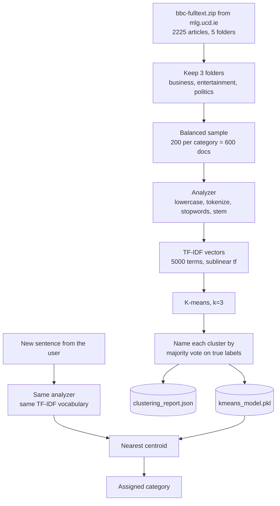

# Document Clustering (Task 2)

Groups news articles into Economics, Entertainment and Politics without being
told which is which, then assigns new text the model has never seen to one of
those groups.

This package is independent of the search engine. It only borrows one thing
from it: `miniseek.analyzer.Analyzer`, so both tasks agree on what counts as a
term.

## How it works



The two halves matter separately. The top half runs once, offline. The bottom
half runs on every request and is fast, because the vocabulary and the
centroids are already fixed.

## Modules

| File | What it does |
|---|---|
| `paths.py` | Where inputs and outputs live. Inputs go in `data/`, generated files go in `outputs/`. |
| `dataset.py` | Downloads the BBC archive from its home page, caches it, takes a balanced sample, records provenance. |
| `model.py` | `ClusteringModel`: fit, predict, top terms per cluster, save and load. |
| `evaluate.py` | Silhouette, inertia, ARI, NMI, homogeneity, completeness, V-measure, confusion matrix. |
| `pipeline.py` | Runs everything once and writes the model plus a JSON report. |
| `service.py` | Loads those artefacts for the API, building them on first use if missing. |

## Running it

```bash
uv run python scripts/run_clustering.py              # 200 per category
uv run python scripts/run_clustering.py --all        # every article
uv run python scripts/run_clustering.py --per-category 100
```

That writes `outputs/clustering/kmeans_model.pkl`,
`outputs/clustering/clustering_report.json` and the figures. The API reads
those files, so the server never has to refit.

## Results

600 documents, 200 per category, k=3.

| Metric | Value |
|---|---|
| Adjusted Rand Index | 0.907 |
| Normalised Mutual Information | 0.864 |
| V-measure | 0.864 |
| Agreement with true labels | 96.8% |
| Silhouette | 0.017 |

Cluster sizes come out at 203, 206 and 191 against a true 200 each, so no
cluster swallowed another. Of the 19 documents placed in the wrong cluster,
10 were Politics and Economics landing in each other, which is the boundary
you would expect to be fuzziest. Entertainment is barely confused with
anything.

## Two things worth knowing

**`sublinear_tf` matters.** With raw term frequency the ARI is 0.827.
Switching to `log(1 + tf)` takes it to 0.907 with nothing else changed.
Without it, a long article that repeats one word thirty times sits far out
along that one axis and pulls a centroid towards it, so the clusters end up
partly about article length rather than topic. This is the same saturation
idea BM25 uses in Task 1. The effect was much larger, 0.44 against 0.91, on a
third-party CSV copy of this dataset that had already been stripped of
punctuation and headlines, which is a reminder that a preprocessing choice can
matter more than the algorithm sitting on top of it.

**Silhouette does not pick k here.** It stays near 0.017 at every k from 2 to
8, which is normal for sparse high dimensional text where almost every pair of
documents is nearly orthogonal. The elbow in inertia is soft too. What does
give a clear answer is ARI, which peaks sharply at k=3:

| k | 2 | 3 | 4 | 5 | 6 | 7 | 8 |
|---|---|---|---|---|---|---|---|
| ARI | 0.509 | **0.907** | 0.766 | 0.673 | 0.405 | 0.405 | 0.380 |

That only works because this corpus has labels. On unlabelled data you would
be stuck with the weak intrinsic signals, which is worth saying plainly rather
than pretending the elbow plot decided it.

## About the Economics label

The brief asks for Economics, Entertainment and Politics. The archive has
folders called business, entertainment, politics, sport and tech. Entertainment
and politics line up directly. Economics does not, so the business folder is
used for it.

That is a reasonable fit but not an exact one. Sampling the folder shows two
kinds of article mixed together. Some are macroeconomic: "Japanese growth
grinds to a halt", "Five million Germans out of work", "Soaring oil hits world
economy". Others are company news: "Ryanair in $4bn Boeing plane deal", "BMW
cash to fuel Mini production", "Absa and Barclays talks continue".

Nothing in the dataset separates those two, and no other folder is closer, so
business is what Economics means here. It is flagged in the interface as well
so a reader is not left assuming the two terms are identical.

## Corpus and licence

D. Greene and P. Cunningham, "Practical Solutions to the Problem of Diagonal
Dominance in Kernel Document Clustering", Proc. 23rd International Conference
on Machine Learning (ICML 2006). Home page:
<http://mlg.ucd.ie/datasets/bbc.html>, archive:
<http://mlg.ucd.ie/files/datasets/bbc-fulltext.zip>

Note that the same page also offers BBCSport (737 articles, five sport
classes). That is a different dataset and is not what this uses.

The BBC provides the data as benchmark material for research only, and keeps
all rights including copyright. Use here is non commercial coursework with
attribution, which is what those terms allow. `dataset.py` writes a provenance
file next to the cached archive so the source travels with the data.
