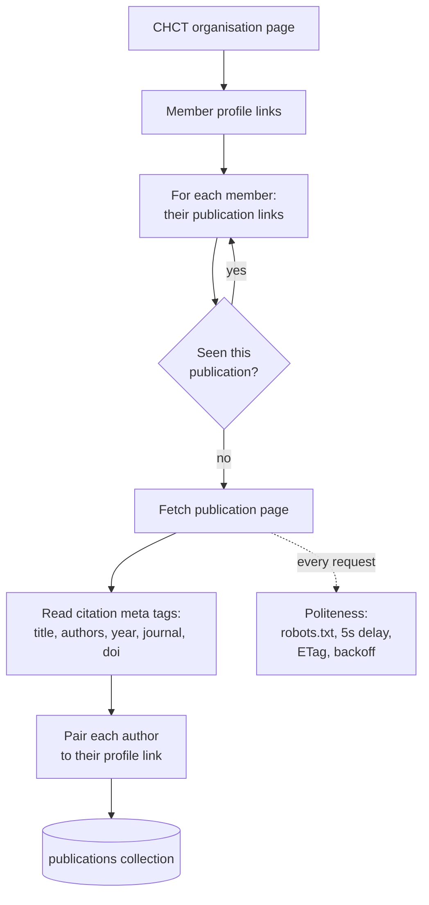

# Crawler (Task 1, data collection)

Collects publications by members of Coventry University's Centre for Healthcare
and Community Transformation from the university research portal.

This package only acquires data. It does not index or search anything. It hands
finished records to `publications`, and the search side reads them from there,
so a crawl can run while the API is serving.

## How it works



Start from members rather than from a publication listing. The portal serves
entity pages, meaning the organisation page, a person, a single publication,
to an automated client, but puts its listing pages behind a bot check. Walking
members reaches the same publications through pages we are allowed to fetch.

## Being polite

| Rule | Where |
|---|---|
| Obey `robots.txt` | `politeness.py` |
| Wait out the 5 second `Crawl-delay` between requests | `politeness.py` |
| Send an honest User-Agent | `fetcher.py` |
| Skip unchanged pages with ETag and Last-Modified | `fetcher.py` |
| Back off on 429 and 5xx, and honour `Retry-After` | `fetcher.py` |
| Never fetch a URL twice in one run | `crawler.py` |

One thing here is worth knowing. `urllib.robotparser` fetches `robots.txt`
using its own user agent, which the portal answers with a 403. On any non 2xx
answer that parser quietly decides everything is disallowed, so the crawler
believed it was banned from the whole site and fell back to the wrong delay as
well. Neither failure raised anything. `politeness.py` now fetches `robots.txt`
itself, with the crawler's real user agent, and feeds the text to the parser.

## Modules

| File | What it does |
|---|---|
| `politeness.py` | Reads `robots.txt`, enforces the crawl delay |
| `fetcher.py` | One polite HTTP GET: rate limited, conditional, retried |
| `extract.py` | Turns a publication page into a `Publication` record |
| `crawler.py` | Walks organisation to members to publications |
| `scheduler.py` | Weekly runs, and remembering when the last one was |

## Running it

```bash
uv run python scripts/crawl.py --once       # one pass, about 7 minutes
uv run python scripts/crawl.py --schedule   # weekly, as the brief asks
uv run python scripts/crawl.py --status     # when it last ran, and what it found
uv run python scripts/crawl.py --once --limit 5   # a quick sample
```

A full run fetches 91 pages and stores 71 publications from 19 members.

## Which publications count

The brief asks for publications where at least one co-author is a member of
the centre. That is exactly what walking member profiles gives us, so reaching
a publication through a member's page is what qualifies it.

The pages also carry a `citation_author_institution` tag, and an early version
required it to name the centre. That threw away most of a valid corpus: the tag
records the affiliation on that particular paper, which is often a different
Coventry department even when a genuine member wrote it. It is now recorded as
a `chct_verified` count for interest, not used as a filter.

## Tests

`tests/test_crawler.py` covers this package with a stand-in fetcher, so the
tests never touch the network and a full run takes under a second.
