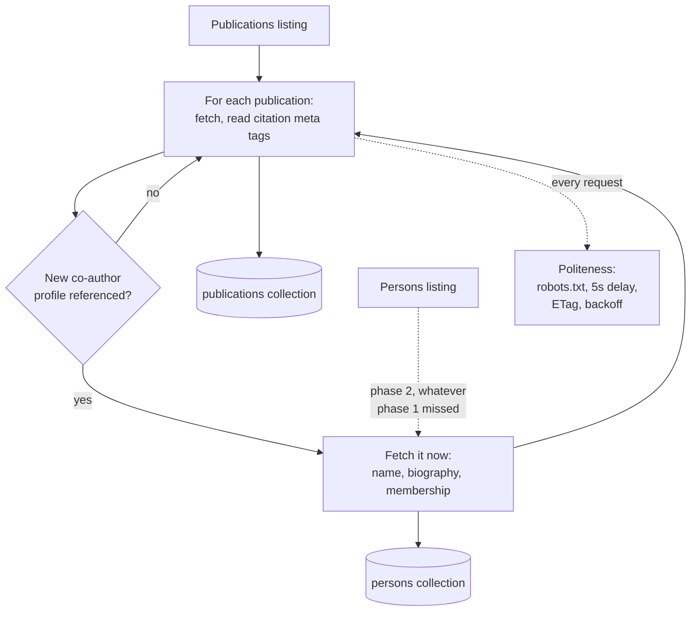

# Crawler (Task 1, data collection)

Collects publications and member profiles from Coventry University's Centre
for Healthcare and Community Transformation, from the university research
portal.

This package only acquires data. It does not index or search anything. It
hands finished records to `publications`, and the search side reads them from
there, so a crawl can run while the API is serving.

## How it works



Publications and members each have their own listing page, paged with
`?page=N`. The portal puts a Cloudflare bot check in front of both, so a crawl
tries the live listing first and falls back to a hand-saved copy in
`data/listings/` (see [Listings and the bot check](#listings-and-the-bot-check)
below) when that fails. Either way, walking the listings is exhaustive: it is
not "start from a handful of members and hope to reach everything by
following co-author links", which is what this crawler did before the
listings were available as a fallback and still does as a last resort (see
[Three phases](#three-phases)) if a listing goes missing entirely.

## Three phases

1. **Every publication the listing names.** Each one is fetched and parsed
   from its Highwire Press `citation_*` meta tags. The moment a publication
   names a co-author profile we haven't fetched yet,
   that profile is fetched right there -- its name, biography and membership
   are recorded immediately, rather than waiting for phase 2. This is what
   makes `persons.jsonl` reflect real people even on a `--limit`-capped test
   crawl that never reaches phase 2.
2. **Whatever the persons listing names that phase 1 didn't already pick up.**
   Usually a small remainder, logged as "N of M already have one".
3. **Reconciliation.** Any publication a visited profile listed that still
   hasn't been crawled gets crawled too, expanding through new links (of
   either kind) until nothing new turns up. This is the fallback that keeps
   the crawl inside the organisation and reaching everything even if a
   listing is incomplete or missing outright -- the way the whole crawl used
   to work before there was a listing to seed from.

## Listings and the bot check

`/publications/` and `/persons/` return 403 from Cloudflare's managed
challenge for any automated client -- not something a user agent string or a
different HTTP client works around, and not something this project attempts
to bypass by pretending to be a browser. Instead: a person browses those pages
normally in their own browser, saves the HTML, and it's committed under
`data/listings/<section>-page<N>.html`. A crawl tries the live page first
(the portal may stop blocking it, or you may be running from an IP it treats
differently) and only reads the saved copy on a 403 -- so nothing is skipped
just because a saved copy happens to be around. It also always probes one
page past whatever is saved, to confirm the saved pages really are the whole
listing rather than a partial one.

## Being polite

| Rule | Where |
|---|---|
| Obey `robots.txt` | `politeness.py` |
| Wait out the 5 second `Crawl-delay` between requests, and log the wait | `politeness.py` |
| Send an honest User-Agent | `politeness.py` |
| Skip unchanged pages with ETag and Last-Modified | `fetcher.py` |
| Back off on 429 and 5xx, and honour `Retry-After` | `fetcher.py` |
| Never fetch a URL twice in one run | `crawler.py` |

One thing here is worth knowing. `urllib.robotparser` fetches `robots.txt`
using its own user agent, which the portal answers with a 403. On any non 2xx
answer that parser quietly decides everything is disallowed, so the crawler
believed it was banned from the whole site and fell back to the wrong delay as
well. Neither failure raised anything. `politeness.py` now fetches
`robots.txt` itself, with the crawler's real user agent, and feeds the text to
the parser.

## Modules

| File | What it does |
|---|---|
| `politeness.py` | Reads `robots.txt`, enforces the crawl delay |
| `fetcher.py` | One polite HTTP GET: rate limited, conditional, retried |
| `extract.py` | Turns a page into a `Publication` or `Person` record |
| `crawler.py` | The three-phase walk described above |
| `scheduler.py` | Runs on an interval (via the `schedule` package), and remembers when it last ran |
| `cli.py` | The `ir-crawl` command |

## Running it

```bash
uv run ir-crawl --once                       # one full pass, ~35-40 minutes
uv run ir-crawl --once --limit 5             # a quick sample: 5 publications
                                              # and their co-authors' profiles
uv run ir-crawl --once --limit 5 --skip-delay  # same, without the 5s delay
                                                # between requests
uv run ir-crawl --schedule                   # weekly, as the brief asks
uv run ir-crawl --schedule 1min --limit 5    # exercise the schedule loop fast:
                                              # a capped crawl every minute,
                                              # instead of waiting a week
uv run ir-crawl --status                     # when it last ran, and what it found

# Redirect a run's own console output somewhere durable, alongside the
# per-crawl log ir-crawl already writes to data/crawls/<id>/crawl.log.
# The 2>&1 matters: logging goes to stderr, so a plain `| tee` only
# captures stdout and silently produces an empty file.
uv run ir-crawl --once 2>&1 | tee logs/full-crawl.log
uv run ir-crawl --schedule 1min --limit 5 2>&1 | tee logs/schedule-test.log
```

`--schedule` takes the interval directly: a number plus a unit (`min`, `h`,
`d`, `w`, `mo`) -- e.g. `100h`, `2weeks`, `1month`. See `ir-crawl --help` for
the full list and more examples.

Each crawl writes its own directory under `data/crawls/<crawl-id>/`:
`publications.jsonl`, `persons.jsonl`, `manifest.json` (counts, timings,
errors), and `crawl.log` (that run's own log, moved in once the crawl
finishes).

## Which publications count

The brief asks for publications where at least one co-author is a member of
the centre. Reaching a publication through the publications listing, or
through a member's own profile page, both count -- either way it is a paper
by someone at the centre.

The pages also carry a `citation_author_institution` tag, and an early
version of this crawler required it to name the centre before keeping a
publication. That discarded most of a valid corpus: the tag records the
affiliation on that particular paper, which is often a different Coventry
department even when a genuine centre member wrote it. It is recorded as
`affiliation_verified` in the manifest for interest, not used as a filter --
`PortalCrawler(require_affiliation=True)` would turn that on, but nothing in
`ir-crawl` exposes it as a flag.

## Tests

`tests/test_crawler.py` covers this package with a stand-in fetcher, so the
tests never touch the network and the whole suite runs in under a second.
