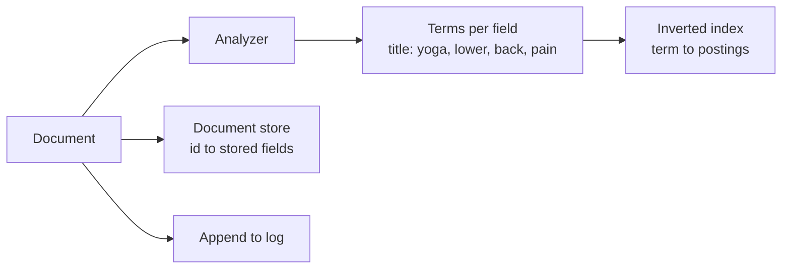
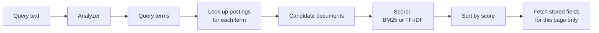
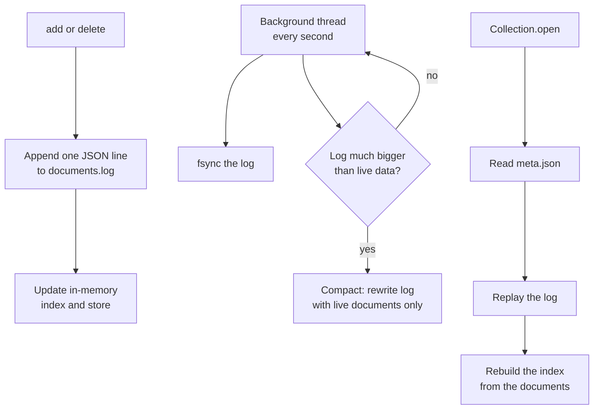

# miniseek

A small search library, written from scratch. No search dependency sits under
this: the tokeniser, the inverted index, the ranking and the storage are all
here.

It is deliberately shaped like [Typesense](https://typesense.org), scaled down
to the parts you need to understand before any of the rest makes sense. You
create a collection with a schema, add documents to it, and search it. The
index lives in memory and durability comes from a log on disk, which is the
same basic arrangement Typesense uses.

The likeness stops at the shape. Typesense is C++, stores documents in RocksDB,
and does typo tolerance, faceting, filtering and clustering across nodes. This
does none of that. It is a few hundred lines whose job is to make the
principles legible, not to be fast or complete.

## Using it

```python
from miniseek.collection import Collection
from miniseek.schema import Field, Schema

schema = Schema(
    fields=(
        Field("id", indexed=False),
        Field("title", weight=3.0),  # a match in the title counts for more
        Field("abstract"),
    )
)

with Collection.open("data/papers", schema=schema, name="papers") as papers:
    papers.add(
        {
            "id": "p1",
            "title": "Yoga for lower back pain",
            "abstract": "A randomised trial of a yoga-based programme.",
        }
    )

    for hit in papers.search("yoga", scorer="bm25"):
        print(hit.score, hit.fields["title"])
```

`Collection.open` reopens what is already on disk. Plain `Collection(...)`
gives you an in-memory one, which is what the tests use.

## Indexing a document



Three things happen and they are kept apart on purpose. The **index** answers
"which documents contain this term". The **store** holds what to display. The
**log** is what makes it survive a restart.

## Searching



The query goes through **the same analyzer** the documents did. That is the
one rule the whole thing rests on: index "retrieval" from a document and
search for "Retrieving", and they only meet because both were stemmed the same
way. Get this wrong and the engine silently finds nothing.

Only documents holding at least one query term are ever scored. That is the
entire point of the inverted index: the candidate set comes from a handful of
dictionary lookups instead of reading every document.

## The pieces

| File | What it holds |
|---|---|
| `analyzer.py` | Text to terms: lowercase, tokenize, drop stopwords, stem |
| `schema.py` | Which fields exist, which are indexed, what each is worth |
| `index.py` | The inverted index, and the lengths and norms ranking needs |
| `store.py` | Documents by id, and the external id to internal id mapping |
| `ranking.py` | `Bm25Scorer`, `TfIdfScorer` and `Coordinated`, behind one `Scorer` protocol |
| `collection.py` | Ties it together, and owns persistence |
| `worked_example.py` | The `ir-bm25` command: checks BM25 against a hand calculation |

Two scorers exist so they can be compared on identical data rather than argued
about. Both follow the same intuition: a term matters more when it is frequent
in this document and rare across the corpus. They disagree about what to do
when a word repeats twenty times, and BM25 wins that argument.

## How much of the query did we match?

Both models sum a contribution per matching term and say nothing about the
terms that missed, so one loud term can beat real coverage. On the real
corpus, `sleep quality students` ranked five documents matching a single term
above the only document matching two of the three, and
`digital intervention mental health` put a three-of-four match above a
four-of-four one.

`Coordinated` wraps either scorer and multiplies by the fraction of the query
a document actually covers — Lucene's old coordination factor:

```
coord(q, d) = matching query terms in d / query terms that exist
```

The denominator counts only terms the index has seen, so a query word present
in no document (`transformation` here, which stems to a term with df=0) does
not quietly scale every result down. Both registered scorers are wrapped, and
they keep their names, so `?scorer=bm25` still selects BM25.

It is a correction, not a cure. On the two queries above it moved the
two-of-three match from 6th to 4th and closed a 26.4-to-19.4 gap to
19.8-to-19.4 — better orderings, but a strong single term can still win.
Ranking those cases properly needs the query treated as more than a bag of
independent words, which is what phrase support would buy.

## Staying on disk



Writes append, they never seek. The log grows with every change, including
overwrites and deletes, so a background thread rewrites it once it holds
`compact_ratio` times as many entries as there are live documents. The default
is 2, meaning it compacts when at least half the log is dead weight, and a
64 entry floor stops a tiny collection compacting constantly. The same thread
flushes to disk once a second, trading a one second window of writes against
paying an fsync on every document.

**Documents are the source of truth and the index is derived from them.** On
open, the index is rebuilt by replaying the log rather than loaded from a file.
That costs a little startup time and buys something worth more: the index can
never drift out of step with the data, because there is no second copy to
drift. It also means changing how text is analysed needs a reindex, not a
recrawl. When a tokeniser bug made `yoga-based` unfindable by searching `yoga`,
fixing it meant reopening the collection. No network, no seven minute crawl.

Compaction and `meta.json` are both written to a temp file and then renamed
over the original, so an interrupted write leaves the previous good file rather
than half of a new one.

## What it does not do

Worth being straight about, since these are the things a real engine spends
most of its effort on:

- No phrase queries. Positions are stored, so it could, but nothing uses them.
- No filtering, faceting, typo tolerance or fuzzy matching.
- One process. The lock makes it thread safe, not multi-process safe.
- The whole index is in memory, and compaction rewrites the entire log, so it
  is sized for thousands of documents rather than millions.
